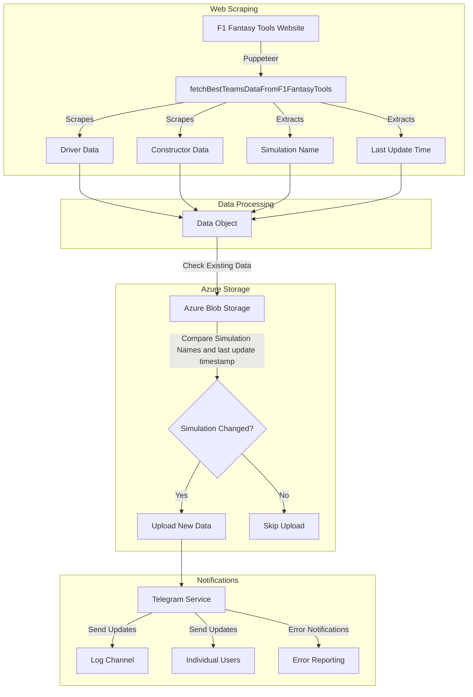

# F1 Fantasy Scraper

A Node.js application that scrapes F1 Fantasy Tools team calculator data and stores it in Azure Blob Storage.

## Features

- Automated scraping of F1 Fantasy Tools team calculator
- Extracts driver and constructor data including:
  - Code/Name
  - Price
  - Expected Price Change (Delta)
  - Expected Points
- Captures simulation metadata:
  - Simulation name
  - Last update timestamp (converted to UTC)
- Stores timestamped data in Azure Blob Storage
- Change detection based on simulation name and last update timestamp
- Docker support for containerized deployment

## System Flow

Below is a detailed flow chart describing how the application works:



### Flow Description

1. **Web Scraping**: The application uses Puppeteer to scrape data from F1 Fantasy Tools website, collecting information about drivers, constructors, simulation name, and last update timestamp.

2. **Data Processing**: All scraped data is combined into a structured data object that includes driver statistics, constructor information, simulation details, and timestamp data converted to UTC format.

3. **Azure Storage**:

   - The system checks for existing data in Azure Blob Storage
   - Compares both simulation name AND last update timestamp
   - Only uploads new data if either the simulation has changed OR the timestamp has updated
   - Enhanced change detection prevents unnecessary uploads while capturing all meaningful updates

4. **Notifications**: Through the Telegram service, the system:
   - Notifies about simulation name changes
   - Notifies about timestamp-only updates (when simulation data refreshes)
   - Provides detailed change information in notifications
   - Sends updates to both a logging channel and individual users
   - Reports any errors that occur during the process

## Prerequisites

- Node.js
- Azure Storage Account
- Docker (optional)

## Environment Variables

Create a `.env` file with the following variables:

- `AZURE_STORAGE_CONNECTION_STRING`: Azure Storage connection string
- `AZURE_STORAGE_CONTAINER_NAME`: Azure Storage container name
- `TELEGRAM_BOT_TOKEN`: Telegram bot API token for notifications

## Telegram Integration

- Real-time notifications for:
  - Simulation changes (includes old and new simulation names)
  - Error reporting
- Supports multiple notification targets:
  - Dedicated logging channel
  - Individual user notifications

## Installation

```bash
npm install
```

## Usage

```bash
npm start
```

## Docker Support

Build the image:

```bash
docker build -t f1-fantasy-scraper .
```

Run the container:

```bash
docker run --env-file .env f1-fantasy-scraper
```

## Development

- `npm run lint`: Run ESLint
- `npm run lint:fix`: Fix ESLint issues
- `npm run format`: Format code with Prettier

## Data Format

```json
{
  "Drivers": [
    {
      "DR": "NOR",
      "price": 31.1,
      "expectedPriceChange": 0.14,
      "expectedPoints": 30.5
    }
  ],
  "Constructors": [
    {
      "CN": "MCL",
      "price": 32.7,
      "expectedPriceChange": 0.3,
      "expectedPoints": 72.9
    }
  ],
  "SimulationName": "Canada. Post-FP2.",
  "SimulationLastUpdate": "2025-06-14T09:24:00.000Z"
}
```

### Field Descriptions

- **Drivers/Constructors**:

  - `DR`/`CN`: Driver/Constructor code (e.g., "NOR", "MCL")
  - `price`: Current price in millions
  - `expectedPriceChange`: Expected price change (delta)
  - `expectedPoints`: Expected points for the race

- **Simulation Metadata**:
  - `SimulationName`: Name of the current simulation
  - `SimulationLastUpdate`: UTC timestamp of when the simulation was last updated (ISO 8601 format)
