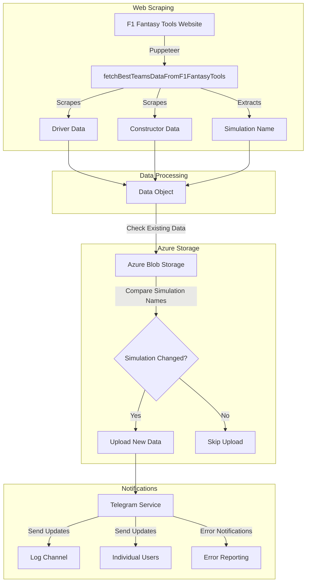

# F1 Fantasy Scraper

A Node.js application that scrapes F1 Fantasy Tools team calculator data and stores it in Azure Blob Storage.

## Features

- Automated scraping of F1 Fantasy Tools team calculator
- Extracts driver and constructor data including:
  - Code/Name
  - Price
  - Delta
  - Points
- Stores timestamped data in Azure Blob Storage
- Docker support for containerized deployment

## System Flow

Below is a detailed flow chart describing how the application works:



### Flow Description

1. **Web Scraping**: The application uses Puppeteer to scrape data from F1 Fantasy Tools website, collecting information about drivers, constructors, and the current simulation name.

2. **Data Processing**: All scraped data is combined into a structured data object that includes driver statistics, constructor information, and simulation details.

3. **Azure Storage**:

   - The system checks for existing data in Azure Blob Storage
   - Compares the current simulation name with the stored one
   - Only uploads new data if the simulation has changed

4. **Notifications**: Through the Telegram service, the system:
   - Notifies about simulation changes
   - Sends updates to both a logging channel and individual users
   - Reports any errors that occur during the process

## Prerequisites

- Node.js
- Azure Storage Account
- Docker (optional)

## Environment Variables

Create a `.env` file with the following variables:

- `AZURE_STORAGE_CONNECTION_STRING`: Azure Storage connection string
- `AZURE_STORAGE_CONTAINER_NAME`: Azure Storage container name
- `TELEGRAM_BOT_TOKEN`: Telegram bot API token for notifications

## Telegram Integration

- Real-time notifications for:
  - Simulation changes (includes old and new simulation names)
  - Error reporting
- Supports multiple notification targets:
  - Dedicated logging channel
  - Individual user notifications

## Installation

```bash
npm install
```

## Usage

```bash
npm start
```

## Docker Support

Build the image:

```bash
docker build -t f1-fantasy-scraper .
```

Run the container:

```bash
docker run --env-file .env f1-fantasy-scraper
```

## Development

- `npm run lint`: Run ESLint
- `npm run lint:fix`: Fix ESLint issues
- `npm run format`: Format code with Prettier

## Data Format

```json
{
  "drivers": [
    {
      "code": "XXX",
      "price": 0.0,
      "delta": 0.0,
      "pts": 0.0
    }
  ],
  "constructors": [
    {
      "code": "XXX",
      "price": 0.0,
      "delta": 0.0,
      "pts": 0.0
    }
  ],
  "simulationName": "string"
}
```
